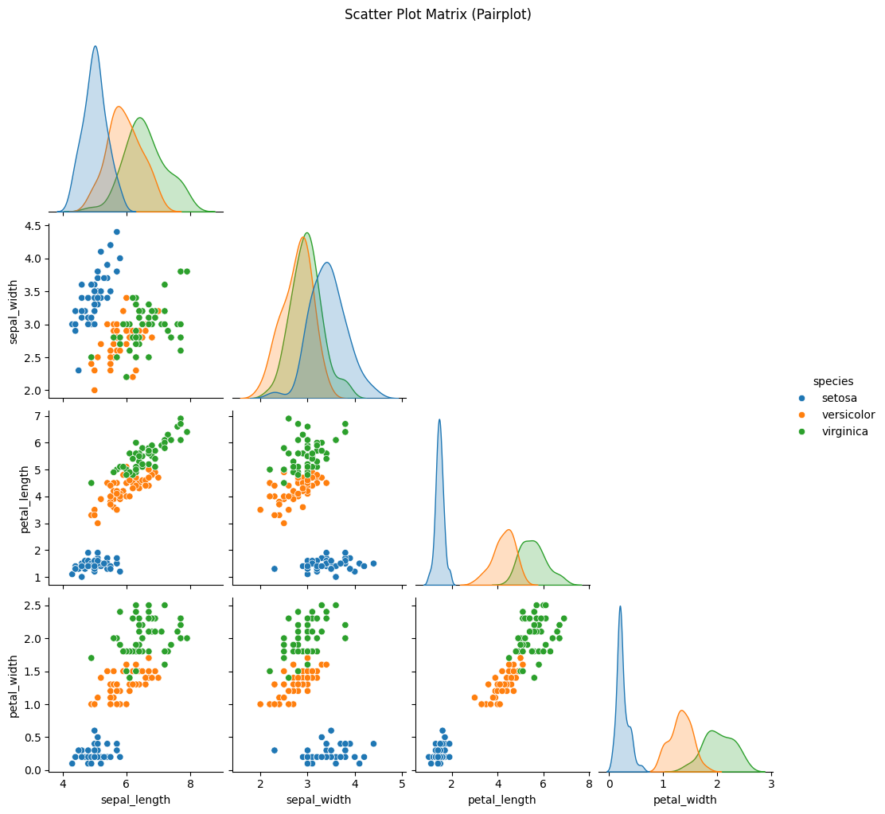
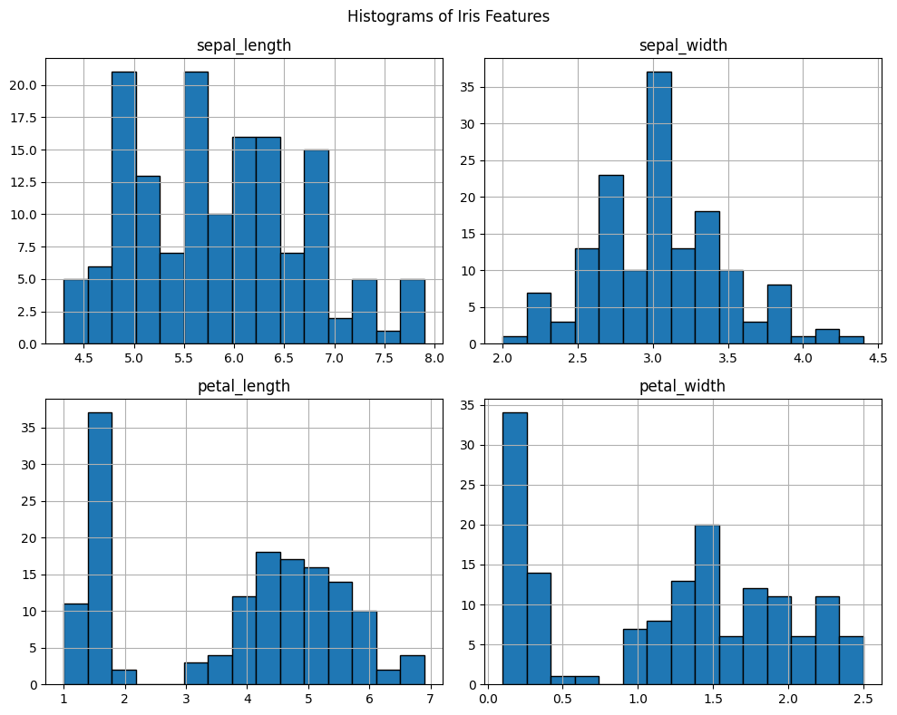
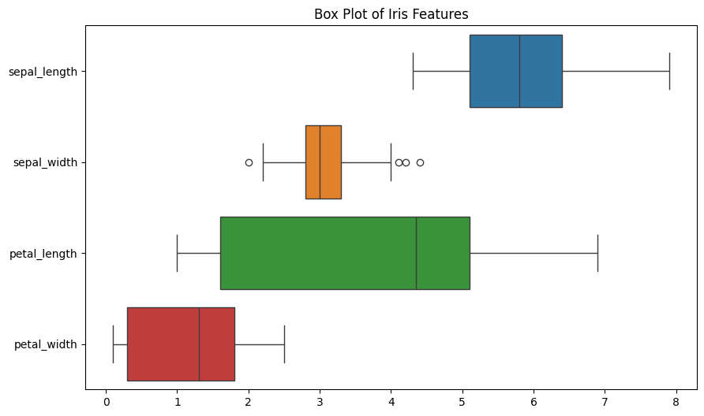
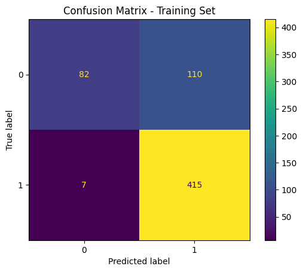
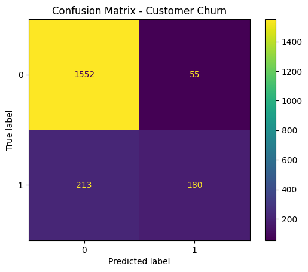
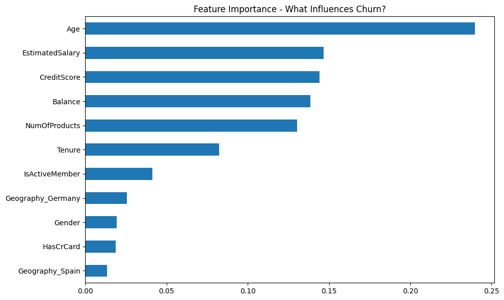

# 📊 Data Science & Analytics Internship Tasks

Welcome to my official submission for the **Data Science & Analytics Internship** at **DevelopersHub Corporation**. This repository contains solutions for three tasks aimed at developing core skills in data exploration, visualization, and predictive modeling using Python.

---

## ✅ Task 1: Exploring and Visualizing the Iris Dataset

### 🎯 Objective
To understand how to load, summarize, and visualize a structured dataset using pandas, matplotlib, and seaborn.

### ⚙️ Approach
- Loaded the **Iris** dataset using seaborn.
- Used `.shape`, `.columns`, `.head()`, and `.describe()` to inspect the dataset.
- Created three types of visualizations:
  - **Pairplot** for feature relationships
  - **Histogram** for data distribution
  - **Boxplot** for outlier detection


### 📊 Results & Insights

- **Discriminatory Power:** petal_length and petal_width are by far the most discriminatory features for separating the Iris species, especially Iris setosa from the other two. They show very clear clustering in the scatter plots and distinct distributions in the histograms and KDEs.
- **Feature Overlap:** sepal_length and sepal_width show more overlap between the species, particularly Iris versicolor and Iris virginica, indicating they are less effective on their own for classification.
- **Outliers:** Only sepal_width shows some outliers in the box plot.
- **Data Distribution:** The multi-modal distributions seen in the histograms (especially petal_length and petal_width) are a strong indicator of the underlying distinct groups (species) within the dataset.
These visualizations effectively illustrate the characteristics of the Iris dataset and provide valuable insights into which features are most important for distinguishing between the different Iris species.


---

---



---

## ✅ Task 2: Credit Risk Prediction

### 🎯 Objective
To predict whether a loan applicant is likely to default using classification techniques.

### ⚙️ Approach
- Loaded the **Loan Prediction** dataset from Kaggle.
- Imputed missing values using mode-based `SimpleImputer`.
- Encoded categorical features with Label Encoding.
- Trained a **Logistic Regression** model on a train/test split.
- Evaluated using **accuracy score** and **confusion matrix**.

### 📊 Results & Insights
- Achieved high accuracy (0.8094462540716613) in predicting loan approval.
- **Strong Recall for the Positive Class:** The model is exceptionally good at identifying positive cases (Recall = 98.3%). This means it rarely misses an actual positive instance.
- **Lower Precision for the Positive Class:** However, its precision for the positive class is lower (79.0%). This indicates that when it predicts something is positive, there's a 21% chance it's actually negative (False Positive).
Poor Specificity for the Negative Class: This is the most significant weakness. The model misclassifies a large number of actual negative instances as positive (110 FPs vs. only 82 TNs). Its specificity is only 42.7%.
- **Trade-off Observed:** There appears to be a trade-off where the model prioritizes identifying positive cases (high recall) even at the cost of incorrectly classifying some negative cases as positive (high false positives, low specificity).
- **Potential Bias/Class Imbalance:** It's worth noting the number of actual positive cases (422) is much higher than actual negative cases (192) in this training set. This class imbalance might influence the model's learning and performance, potentially contributing to the higher number of false positives if the model is biased towards predicting the majority class (positive).
- **Training Set Performance:** These results are on the training set. It's crucial to evaluate this model on a separate, unseen test set to ensure it generalizes well and is not overfitting. Performance on the test set might differ, especially if overfitting has occurred.
---


---

## ✅ Task 3: Customer Churn Prediction

### 🎯 Objective
To predict which customers are likely to leave a bank using classification and feature analysis.

### ⚙️ Approach
- Loaded the **Churn Modelling Dataset**.
- Dropped irrelevant columns and applied **One-Hot Encoding**.
- Trained a **Random Forest Classifier** to handle mixed data types.
- Evaluated model using **accuracy** and visualized a **confusion matrix**.
- Analyzed **feature importance** to derive customer behavior insights.

### 📊 Results & Insights
- Achieved high accuracy 0.866 in predicting churn.
### From the Confusion Matrix (Customer Churn):

- **High True Negatives:** The model is very good at correctly identifying customers who will not churn (1552 True Negatives).
Moderate True Positives: It correctly identifies a fair number of customers who will churn (180 True Positives).
- **Low False Positives:** The model rarely incorrectly predicts that a customer will churn when they won't (only 55 False Positives). This means it's precise when it predicts churn.
- **Significant False Negatives:** The model misses a substantial number of actual churners (213 False Negatives). This indicates it's less effective at capturing all customers who will churn.
- **Implication:** The model is highly precise in its churn predictions but has a notable number of 'misses' for actual churners. This suggests a trade-off, potentially prioritizing avoiding false alarms over catching every churner.



### From the Feature Importance (What Influences Churn?):

- **Top Influencers:** Age is by far the most important factor influencing churn, followed by Estimated Salary, Credit Score, and Balance. These four features are the primary drivers of churn.
- **Moderate Influence:** NumOfProducts and Tenure also play a significant role, though less than the top four.
- **Lower Influence:** IsActiveMember, Geography_Germany, Gender, HasCrCard, and Geography_Spain have relatively minor impacts on churn compared to the top features.
- **Practical Use:** To prevent churn, focusing on interventions targeted at different age groups, managing financial aspects (salary, credit, balance), and product engagement would likely be most effective.



---

## 🧠 Conclusion

Through these tasks, I gained practical experience in:
- Data cleaning and preprocessing
- Exploratory Data Analysis (EDA)
- Classification modeling using `scikit-learn`
- Visualization using `matplotlib` and `seaborn`
- Extracting actionable insights from data

Each task is contained in its own folder with Jupyter notebooks and a detailed README.

---

## 📂 Repository Structure

```bash
DATASCIENCE-ANALYTICS/
├── Task1.ipynb
├── README.md
├── Task2.ipynb
├── Task3.ipynb
```
---

## 🛠️ Tech Stack

- Python 3.8+
- pandas
- seaborn
- matplotlib
- scikit-learn

---
